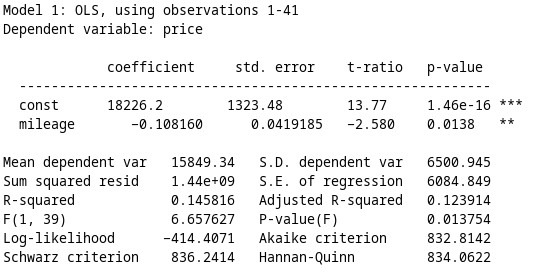

::: {.cell}

```{.r .cell-code}
source("assignmentQandA.R")
```

::: {.cell-output .cell-output-stderr}

```

Attaching package: 'dplyr'
```


:::

::: {.cell-output .cell-output-stderr}

```
The following objects are masked from 'package:stats':

    filter, lag
```


:::

::: {.cell-output .cell-output-stderr}

```
The following objects are masked from 'package:base':

    intersect, setdiff, setequal, union
```


:::
:::


# Inroduction

Would like to refer to [@wickham2023r] abc

Model 1
$$price_i=\beta_0+\beta_1 mileage_i + u_i$$

Model 2
$$price_i=\beta_0+\beta_1 mileage_i+ \beta_2 mileage_i^2 + u_i$$

# Data 

# Results


::: {.cell}

```{.r .cell-code}
tidres1
```

::: {.cell-output .cell-output-stdout}

```
# A tibble: 2 × 5
  term         estimate std.error statistic  p.value
  <chr>           <dbl>     <dbl>     <dbl>    <dbl>
1 (Intercept) 18226.    1323.         13.8  1.46e-16
2 mileage        -0.108    0.0419     -2.58 1.38e- 2
```


:::
:::

::: {.cell}

```{.r .cell-code}
glares1
```

::: {.cell-output .cell-output-stdout}

```
# A tibble: 1 × 12
  r.squared adj.r.squared sigma statistic p.value    df logLik   AIC   BIC
      <dbl>         <dbl> <dbl>     <dbl>   <dbl> <dbl>  <dbl> <dbl> <dbl>
1     0.146         0.124 6085.      6.66  0.0138     1  -414.  835.  840.
# ℹ 3 more variables: deviance <dbl>, df.residual <int>, nobs <int>
```


:::
:::


# Predictions

# Appendix


::: {.cell}

```{.r .cell-code}

```

::: {.cell-output-display}
{#fig-mod1 width=266}
:::
:::


@fig-mod1 shows GRETL output ...


::: {.cell}

```{.r .cell-code}
# predict()
```
:::

::: {.cell}

```{.r .cell-code}
knitr::knit_exit()
```
:::

